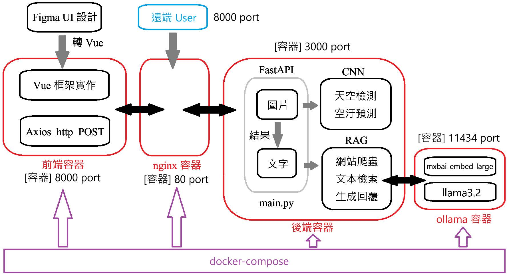

# 🏞️ Air Quality Visual Question Answering (VQA) System

This project is a **full-stack web application** designed for **Visual Question Answering (VQA)** focused on environmental assessment, specifically **air quality prediction** and recommendation generation based on sky images.

It leverages a modern microservice architecture, combining a powerful language model (LLM) for dialogue and prediction logic for analysis.

-----

## 🚀 Key Features

  * **Multimodal VQA:** Upload an image (e.g., a photo of the sky) and ask natural language questions about the air quality, conditions, or related health advice.
  * **Retrieval-Augmented Generation (RAG):** Integrates an LLM with a knowledge base (vector store) to provide accurate, grounded, and context-specific recommendations (e.g., health or improvement advice).
  * **Containerized Deployment:** The entire application is packaged using Docker and orchestrated with Docker Compose for easy, consistent deployment across different environments (including local development and **GCP**).
  * **User-Friendly UI:** Provides an interactive web interface built with Vue.js for seamless image input and result display.

-----

## 📺 Demo


You can see a demo of the system here: https://youtu.be/FCwNgOD7UxE

-----

## 🏛️ System Architecture

The application employs a standard microservice architecture separated into three main containers, managed by **Nginx** for routing:

1.  **Frontend:** Vue.js application follows a modular Vue 3 + Vite architecture, using TypeScript for robustness and BootstrapVue for styling. It acts as a lightweight SPA that communicates with the Python backend via Axios, offering users an interactive and responsive web experience.
2.  **Backend (API):** Python application (likely using FastAPI) that handles API requests, model inference, and RAG coordination.
3.  **Ollama (LLM):** Containerized environment hosting the local Large Language Model for chat and RAG execution.




-----

## ⚙️ Tech Stack & Dependencies

### Hardware Requirements (GCP Optimized)

| Specification | Detail |
| :--- | :--- |
| **Machine Type** | `n1-standard-8` |
| **vCPUs** | 8 |
| **RAM** | 30 GiB |
| **GPU** | **NVIDIA T4** (1 unit) |
| **Operating System** | **Ubuntu 22.04 LTS** |

### Software Dependencies

The following dependencies are required on the host system:

  * **Git LFS**
  * **Docker**
  * **Docker Compose**
  * **CUDA Driver** and **cuDNN** (Required for GPU usage with the T4)

For a hassle-free installation on a **Ubuntu GCP instance**, run the setup script:

```bash
bash GCP-install-dependencies.sh
```

### Core Application Technologies

| Component | Technology | Role |
| :--- | :--- | :--- |
| **Backend/API** | **Python** (via `main.py`, `rag.py`) | Handles basic logic, prediction inference (`sky_test_v1.py`, `model_v3.py`), and serves the RAG/VQA endpoints. |
| **Frontend/UI** | **Vue.js** / **Vite** | Provides the interactive web interface and guides. |
| **LLM Engine** | **Ollama** | Manages and serves the local Large Language Model used for RAG responses. |
| **Vector Store** | **ChromaDB** (`chroma.sqlite3`) | Stores domain-specific knowledge embeddings used by the RAG pipeline. |

-----

## 🛠️ Setup Instructions

### 1\. Set Up VQA Models (`.h5` files)

This project requires external machine learning model files (`.h5`) to run the prediction logic in the backend. These files are managed using Git LFS (Large File Storage).

1.  **Ensure `git` and `git-lfs` are installed.**
    If you don’t have Git LFS installed, initialize it:

    ```bash
    git lfs install
    ```

2.  **Navigate to the `backend` directory.**

    ```bash
    cd backend
    ```

3.  **Clone the `VQAmodels` repository** from Hugging Face into a temporary `models` folder:

    ```bash
    git clone https://huggingface.co/930727fre/VQAmodels models
    ```

4.  **Move the `.h5` files** to the main `backend` directory:

    ```bash
    mv models/*.h5 .
    ```

5.  **Remove the empty `models` directory** once files are moved:

    ```bash
    sudo rm -drf models
    ```

    Return to the project root:

    ```bash
    cd ..
    ```

### 2\. Prepare the Ollama LLM

The RAG pipeline requires an LLM. This project uses Ollama to manage the model.

1.  Navigate to the Ollama directory:
    ```bash
    cd backend/ollama
    ```
2.  Run the script to pull the necessary model (as configured):
    ```bash
    bash pull-model.sh
    ```
    Return to the project root:
    ```bash
    cd ../..
    ```

-----

## 🚀 Running the Application

Ensure you are on the `main` branch, all dependencies are installed, and models are set up.

1.  **Navigate to the project directory:**

    ```bash
    cd VQAweb
    ```

2.  **Configure Frontend IP (Important)**
    You must modify the frontend code to point to your server's IP address.
    In the file `frontend/Present/src/components/PictureInput.vue`, replace `localhost` in the `axios.post` line with your `<server_IP>`.

3.  **Run the entire system using the script:**
    The following script builds and runs the Docker containers defined in `docker-compose.yml`.

    ```bash
    ./docker_run.sh
    ```

    *If you encounter execution issues, make the script executable first:*

    ```bash
    chmod +x ./docker_run.sh
    ./docker_run.sh
    ```

4.  **Access the application:**
    Visit the following address in your web browser:

    ```
    http://<server_IP>:8000
    ```

    (Note: The default port is set to **8000** in this deployment configuration.)

5.  **To stop the application:**
    Press `Ctrl + C` in the terminal where the script is running.

    **Note on Cleanup:**
    If Docker images are not successfully deleted after stopping the containers, you may need to manually inspect and modify the `docker rmi` command within the `./docker_run.sh` script to ensure proper cleanup.

-----

## 📂 Project Structure Overview

```
.
├── GCP-install-dependencies.sh     # Script for GCP setup
├── Ubuntu-install-docker.sh        # Script for Docker installation on Ubuntu
├── air-predict.ipynb               # Jupyter notebook for initial prediction model development
├── backend                         # Python API, Models, and RAG logic
│   ├── Dockerfile                  # Defines the backend container image
│   ├── main.py                     # Backend API entry point (FastAPI)
│   ├── rag.py                      # RAG implementation logic
│   ├── ollama                      # Ollama container setup and model pulling
│   └── vectorstore_db              # ChromaDB files and knowledge base
├── docker-compose.yml              # Defines multi-container application services
├── frontend                        # Vue.js application source
│   └── Present                     # The main frontend component (Vue/Vite)
├── images                          # System architecture diagrams
└── nginx                           # Nginx configuration and Docker setup
```